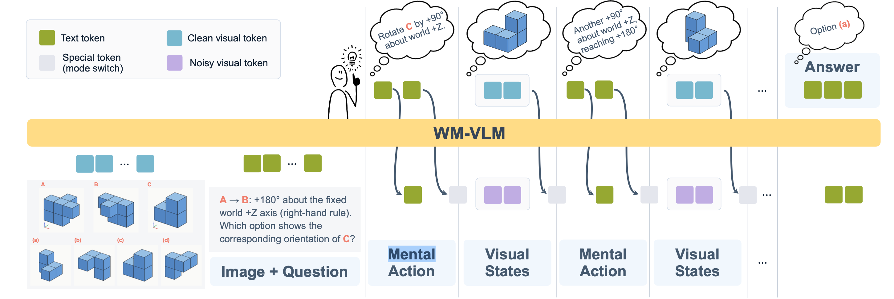

# WM-VLM: Probing Internal World Models for Interleaved Visual-Textual Reasoning

**Yuheng Zha, Yilei Wang, Qiyue Gao, Junrong Chen, Yujia Wu, Zhengfeng Lai, Zhengzhong Liu, Eric P. Xing**

[](https://arxiv.org/abs/2609.34826)
[](https://github.com/yuh-zha/wm-vlm)
[](https://huggingface.co/collections/yzha/wm-vlm)
[]([https://x.com/TODO](https://x.com/yzha_zha/status/2107223573182263776))

<p align="left">
  
</p>

We study a kind of model: it reasons in both visual and textual space, to solve spatial reasoning problems. This repo shares the dataset and code used in the paper. You can use it to reproduce the results in the paper.

## Environment

Create a Conda environment and install the dependencies:

```bash
conda create -n wm-vlm python=3.11 -y
conda activate wm-vlm
pip install -r requirements.txt
```

The default requirements are fully pinned to the stack used to reproduce the
released checkpoint predictions.

The released training and evaluation launchers use eight GPUs by default. Set
`WORLD_SIZE` for training or `NUM_SHARDS` for evaluation to match your setup.

## Data

The Tetris datasets are available through Hugging Face:

- [Tetris-2D train](https://huggingface.co/datasets/yzha/Tetris-2D)
- [Tetris-2D ID](https://huggingface.co/datasets/yzha/Tetris-2D-ID) and [Tetris-2D OOD](https://huggingface.co/datasets/yzha/Tetris-2D-OOD)
- [Tetris-3D train](https://huggingface.co/datasets/yzha/Tetris-3D)
- [Tetris-3D SC-ID](https://huggingface.co/datasets/yzha/Tetris-3D-SC-ID), [Tetris-3D C-ID](https://huggingface.co/datasets/yzha/Tetris-3D-C-ID), and [Tetris-3D OOD](https://huggingface.co/datasets/yzha/Tetris-3D-OOD)

Load a dataset directly from the Hub with `datasets`:

```python
from datasets import load_dataset

train_2d = load_dataset("yzha/Tetris-2D", split="train")
eval_2d_id = load_dataset("yzha/Tetris-2D-ID", split="eval")
eval_3d_c_id = load_dataset("yzha/Tetris-3D-C-ID", split="eval")
```

Each example includes the task fields, its source record, and embedded problem
and intermediate images.

To run the repository's evaluation scripts, download the dataset repositories
into their expected local paths:

```bash
DATASET_OWNER=yzha
for name in \
  Tetris-2D Tetris-2D-ID Tetris-2D-OOD \
  Tetris-3D Tetris-3D-SC-ID Tetris-3D-C-ID Tetris-3D-OOD; do
  hf download "${DATASET_OWNER}/${name}" \
    --repo-type dataset \
    --local-dir "datasets/${name}"
done
```

This produces the following layout:

```text
datasets/
├── Tetris-2D/          # 4,000 training examples
├── Tetris-2D-ID/       # 400 ID evaluation examples
├── Tetris-2D-OOD/      # 500 OOD evaluation examples
├── Tetris-3D/          # 16,000 training examples
├── Tetris-3D-SC-ID/    # 400 same-configuration ID examples
├── Tetris-3D-C-ID/     # 400 compositional ID examples
└── Tetris-3D-OOD/      # 500 OOD evaluation examples
```

## Inference

### Hugging Face generation

WM-VLM checkpoints support the standard Hugging Face image-to-text AutoClass.
The following example uses a question from Tetris-2D and follows the same
prompt construction and image preprocessing as the repository's inference
code:

```python
from PIL import Image
import torch
from transformers import AutoModelForImageTextToText, AutoProcessor

from wm_vlm.constants import WM_VLM_SYSTEM_PROMPT

checkpoint = "yzha/WM-VLM-Tetris-2D"
processor = AutoProcessor.from_pretrained(
    checkpoint,
    trust_remote_code=True,
    use_fast=False,
)
model = AutoModelForImageTextToText.from_pretrained(
    checkpoint,
    trust_remote_code=True,
    torch_dtype=torch.bfloat16,
).to("cuda").eval()

image = Image.open("problem.png").convert("RGB")
question = """Image (A) is to image (B) as image (C) is to which of the following options?
The transformation from (A) to (B) is: 270° clockwise rotation.
Note: the colours of the options are random and irrelevant — answer based on shape only.
Options:
(a) Option a
(b) Option b
(c) Option c
(d) Option d"""

messages = [
    {"role": "system", "content": WM_VLM_SYSTEM_PROMPT},
    {
        "role": "user",
        "content": [
            {"type": "image"},
            {"type": "text", "text": question},
        ],
    },
]
prompt = processor.apply_chat_template(
    messages,
    tokenize=False,
    add_generation_prompt=True,
)
inputs = processor(
    text=[prompt],
    images=[image],
    padding=True,
    return_tensors="pt",
)
inputs = {
    name: value.to(model.device) if isinstance(value, torch.Tensor) else value
    for name, value in inputs.items()
}
answer_end_ids = tuple(
    processor.tokenizer.encode("</answer>", add_special_tokens=False)
)

sequences = model.generate(
    **inputs,
    max_new_tokens=256,
    do_sample=False,
    flow_steps=1,
    flow_solver="euler",
    flow_seed=0,
    flow_noise_device="cpu",
    flow_state_dtype=torch.bfloat16,
    stop_token_sequences=(answer_end_ids,),
)
generated = sequences[:, inputs["input_ids"].shape[1]:]
print(processor.tokenizer.decode(
    generated[0],
    skip_special_tokens=True,
    clean_up_tokenization_spaces=False,
).strip())
```

Hub checkpoints contain custom WM-VLM model code, so
`trust_remote_code=True` is required. Review the code and pin a Hub revision
when using a checkpoint in production.

### Reproduce the main results

The released [Tetris-2D checkpoint](https://huggingface.co/yzha/WM-VLM-Tetris-2D)
and [Tetris-3D checkpoint](https://huggingface.co/yzha/WM-VLM-Tetris-3D)
are approximately 18.5 GB each. Download them into the paths used below:

```bash
hf download yzha/WM-VLM-Tetris-2D \
  --local-dir checkpoints/wm_vlm_tetris_2d_middle_checkpoint_7500
hf download yzha/WM-VLM-Tetris-3D \
  --local-dir checkpoints/wm_vlm_tetris_3d_bottom_checkpoint_30000
```

Evaluate the Tetris-2D checkpoint on the ID and OOD splits:

```bash
NUM_SHARDS=8 bash scripts/reproduce/evaluate_wm_vlm_parquet.sh \
  checkpoints/wm_vlm_tetris_2d_middle_checkpoint_7500 \
  outputs/main_results/tetris_2d \
  id=datasets/Tetris-2D-ID/data/eval-00000-of-00001.parquet \
  ood=datasets/Tetris-2D-OOD/data/held_out-00000-of-00001.parquet
```

Evaluate the Tetris-3D checkpoint on the SC-ID, C-ID, and OOD splits:

```bash
NUM_SHARDS=8 bash scripts/reproduce/evaluate_wm_vlm_parquet.sh \
  checkpoints/wm_vlm_tetris_3d_bottom_checkpoint_30000 \
  outputs/main_results/tetris_3d \
  sc_id=datasets/Tetris-3D-SC-ID/data/eval-00000-of-00001.parquet \
  c_id=datasets/Tetris-3D-C-ID/data/eval-00000-of-00001.parquet \
  ood=datasets/Tetris-3D-OOD/data/held_out-00000-of-00001.parquet
```

Each command runs one shard per GPU and writes the combined scores to
`aggregated_metrics.json` in its output directory. The launcher defaults to
the paper's main-result settings: one Euler flow step, seed 0, BF16 flow state,
and BF16 model weights.

## Training

The trainer expects a JSONL manifest whose ordered `segments` interleave input
text/images and supervised text/visual states. Tetris manifests use
`manifest_wm_vlm_train.jsonl` under the corresponding released dataset
directory. Training consumes these released manifests directly.

Training has two stages. Stage 1 learns the visual generation branch with flow
matching while the pretrained VLM is frozen. Stage 2 starts from the final
Stage-1 checkpoint and trains answer generation on the generated visual states;
the vision encoder remains frozen.

For Tetris-2D:

```bash
bash scripts/reproduce/train_wm_vlm.sh \
  tetris-2d stage1 runs/tetris-2d/stage1

bash scripts/reproduce/train_wm_vlm.sh \
  tetris-2d stage2 runs/tetris-2d/stage2 \
  runs/tetris-2d/stage1/checkpoint-50000
```

Use `tetris-3d` for Tetris-3D; its default final Stage-1 checkpoint is
`checkpoint-200000`:

```bash
bash scripts/reproduce/train_wm_vlm.sh \
  tetris-3d stage1 runs/tetris-3d/stage1

bash scripts/reproduce/train_wm_vlm.sh \
  tetris-3d stage2 runs/tetris-3d/stage2 \
  runs/tetris-3d/stage1/checkpoint-200000
```

Override `DATA_ROOT` and `MANIFEST` for another compatible copy of the selected
Tetris dataset. For a new dataset schema or size, invoke
`scripts/train/train_wm_vlm.py` directly with the corresponding manifest and
task arguments.

## Citation

If you find this work useful, please cite:

```bibtex
@article{zha2026wmvlm,
  title   = {{WM-VLM}: Probing Internal World Models for Interleaved Visual-Textual Reasoning},
  author  = {Zha, Yuheng and Wang, Yilei and Gao, Qiyue and Chen, Junrong and Wu, Yujia and Lai, Zhengfeng and Liu, Zhengzhong and Xing, Eric P.},
  journal = {arXiv preprint arXiv:2609.34826},
  year    = {2026}
}
```
